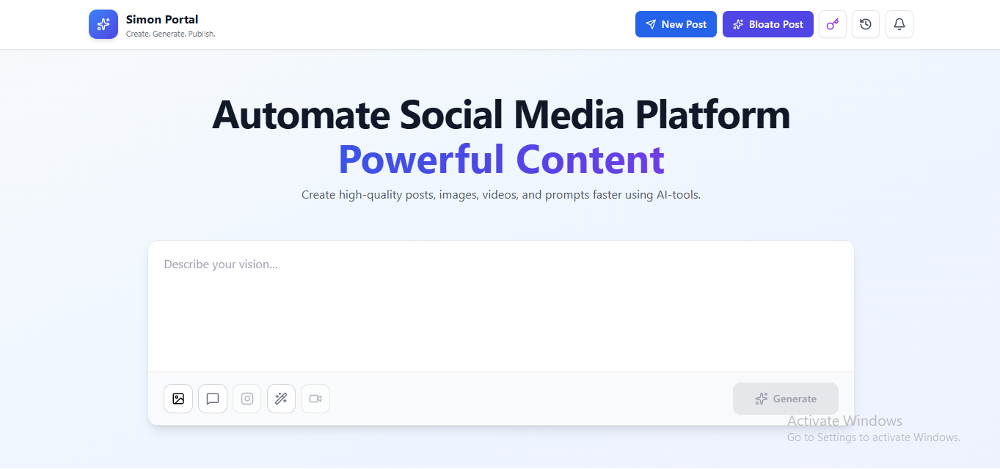
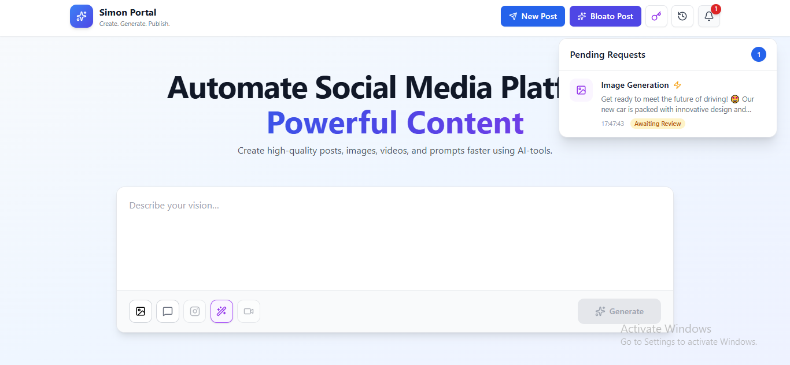
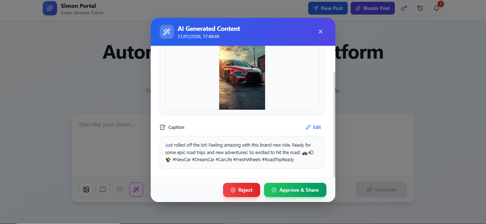
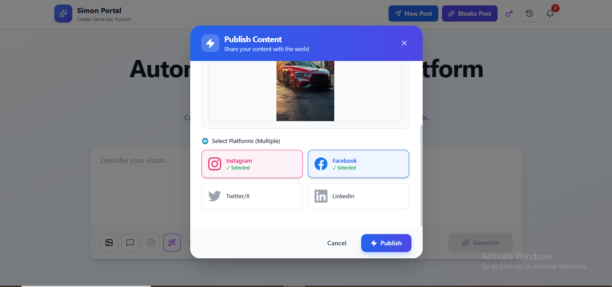

# Simon Portal

**Simon Portal** is an AI-powered social media automation platform that helps users create, review, approve, and publish social media content across multiple platforms from a single dashboard.

The system is intentionally kept simple and practical, focusing only on working, production-ready features with manual approval control.

---

## 🚀 Key Highlights

* AI-assisted text generation and enhancement
* Text-to-image generation
* Manual approval and rejection workflow
* Multi-platform social media publishing
* Complete content history and status tracking

---

## 🧠 Technology Stack

### Frontend

* React.js
* Tailwind CSS

### Backend

* Node.js
* MySQL

### AI & Automation

* **Text AI**: Gemini API
* **Image AI**: Pollinations (Free API)
* **Automation Engine**: n8n

### Social Media Integrations

* Instagram
* Facebook
* Twitter (X)
* LinkedIn

---

## 📸 Screenshots

> Add project screenshots in the `/screenshots` folder and reference them below.

```md
/screenshots/login.png
/screenshots/dashboard.png
/screenshots/create-post.png
/screenshots/ai-content.png
/screenshots/history.png
```

Example usage:

```md


```

---

## 🔐 User Flow (Step-by-Step)

### Step 1: Login

User logs in to Simon Portal using valid credentials.

[Login Screen](./public/login.png)

---

### Step 2: Write Prompt / Custom Text

* User enters custom text in the input box.
* This text works as a **prompt**.
* User can manually edit the text before generating content.




---

### Step 3: AI Content Generation

#### Text Processing

* The entered text is sent to **Gemini API**.
* Gemini improves text quality, tone, and structure.

#### Image Generation

* The same prompt is used to generate an image.
* Image generation is done using **Pollinations API**.
* Image generation runs asynchronously.


---

### Step 4: Notification & Review

* Once image generation is complete, a notification is shown.
* User can:

  * View generated image
  * Review caption
  * Edit caption if needed



---

### Step 5: Approve or Reject





#### Approve

* User selects platforms:

  * Instagram
  * Facebook
  * Twitter (X)
  * LinkedIn
* On approval, content is sent to **n8n workflow**.
* n8n handles publishing via platform APIs.





#### Reject

* Content is rejected.
* No publishing occurs.
* Status is saved for record.

---

### Step 6: Publish Content

* Approved content is published to selected platforms.
* Publishing is handled by **n8n automation workflows**.

---

### Step 7: Content History

The **History** section shows:

* Pending posts
* Approved posts
* Rejected posts

From history, user can:

* Re-approve pending content
* Reject pending content
* Track publish status

<<<<<<< HEAD

=======

>>>>>>> 14ba205dcf7621043fbb521a50f2cb1ac91b3aba

---

## 🔄 n8n Workflow Overview

n8n is responsible for:

* Receiving generated image URLs
* Managing approval flow
* Routing content to correct social platform
* Executing API calls for publishing

<<<<<<< HEAD


=======
>>>>>>> 14ba205dcf7621043fbb521a50f2cb1ac91b3aba
Each platform has its own conditional workflow path:

* Instagram
* Facebook
* Twitter (X)
* LinkedIn

---

## 📌 Current Features (Stable)

* Custom post creation
* AI-enhanced captions
* Text-to-image generation
* Approval & rejection system
* Multi-platform publishing
* Content history tracking

---

## 🔮 Future Scope

### Bloato Integration

* Planned support for 10+ social platforms
* Advanced scheduling
* Bulk posting

---

## ✅ Benefits

* Simple and fast workflow
* Full manual control before publishing
* Multi-platform posting from one place
* Clear audit trail with history

---

## 📄 Conclusion

Simon Portal is a focused, production-ready solution for AI-based social media content creation and publishing. It combines Gemini for text intelligence, Pollinations for image generation, and n8n for automation—providing a clean and controlled workflow with room for future expansion.

---

**Author:** Sumit
