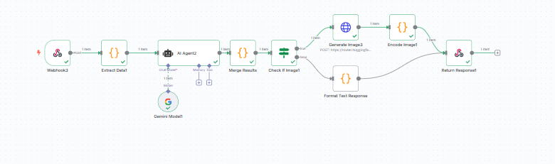

🧠 AI Content Studio
Create. Generate. Publish.
AI Content Studio is an intelligent content automation platform that transforms raw ideas into high-quality AI content and automatically publishes it on social media after approval.

Live Concept
AI Content Studio provides an end-to-end workflow:
Idea → AI Generation → Approval → Auto-Posting

Core Features
Idea to AI Prompt Conversion
Users can enter any raw idea or text. With one click, the system converts it into an optimized AI-ready prompt.
AI Content Generation (4 Modes)
The platform supports four main AI modes:
ModeDescriptionChatGPT PromptConverts ideas into powerful ChatGPT promptsSocial Media PostGenerates ready-to-publish social media contentImage GenerationCreates AI image prompts and generates imagesUGC Video ScriptCreates short-form UGC video scripts
Image & Video from Prompt
Generate AI images directly from your prompt or create UGC video scripts using your prompt with optional image support.
Approval Workflow + Automation
Every generated item creates an approval request:

The request appears in the notification panel
Admin/User reviews the content
After approval, the system automatically triggers n8n automation and posts the content to selected social media platforms

n8n Integration

All content generation and publishing actions are connected to n8n workflows:

AI processing through LLM APIs
Image generation via AI services
Approval handling and workflow logic
Social media posting automation to Twitter, LinkedIn, Instagram

This allows the platform to run without manual intervention after approval.
n8n Workflow Components:

Webhook triggers for content requests
AI Agent for intelligent processing
Gemini Vision for image analysis
Multiple image generation and encoding nodes
Format text response handling
Return response to frontend

Smart Notification System
Each request is tracked with real-time status: Pending, Approved, or Rejected. Users can preview, approve, or reject content directly from the notification panel.

Tech Stack
LayerTechnologyFrontendReact.js, Tailwind CSSAutomationn8nAI ProcessingLLM APIs via n8nUI IconsLucide ReactState ManagementReact HooksDeployment ReadyYes

Application Flow
User Idea
   ↓
AI Mode Selection
   ↓
AI Content Generated
   ↓
Approval Request Created
   ↓
Notification Panel
   ↓
Admin Approval
   ↓
n8n Automation Triggered
   ↓
Social Media Auto-Posting

User Interface Highlights

Clean modern UI with intuitive navigation
Dark and Light mode support
Animated transitions for smooth experience
Live preview before publishing
Comprehensive approval and notification dashboard

How to Run Locally
Prerequisites

Node.js v16 or higher
n8n instance running (local or cloud)
API keys for AI services

Installation Steps
bash# Clone the repository
git clone <your-repo-url>
cd ai-content-studio

# Install dependencies
npm install

# Configure environment variables
cp .env.example .env
# Edit .env with your n8n webhook URL and API keys

# Start development server
npm run dev
n8n Setup

Import the workflow from /n8n-workflows/content-studio.json
Configure webhook URLs in the workflow
Add your AI service credentials (OpenAI, Gemini, etc.)
Activate the workflow
Copy the webhook URL to your .env file

Use Cases

Social media agencies managing multiple clients
Marketing teams automating content pipelines
Content creators scaling their output
AI automation platforms needing content workflows
SaaS product builders integrating AI features

Why This Project is Valuable
This system removes manual work from the entire content lifecycle and replaces it with a fully automated AI-driven publishing pipeline.
Key Benefits:
Save Hours Daily by automating content creation and publishing
Consistent Quality through AI-powered brand-aligned content
Approval Control with human oversight before publishing
Multi-Platform posting to all social channels simultaneously
Scalable infrastructure to handle unlimited content requests
Extensible architecture to add new AI modes and platforms
